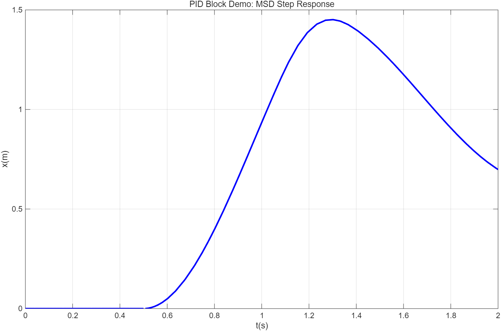
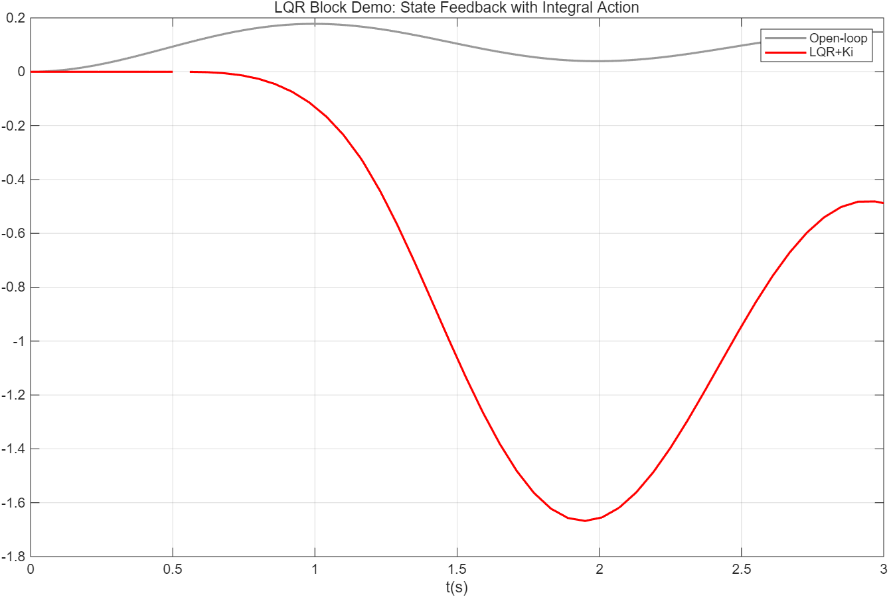
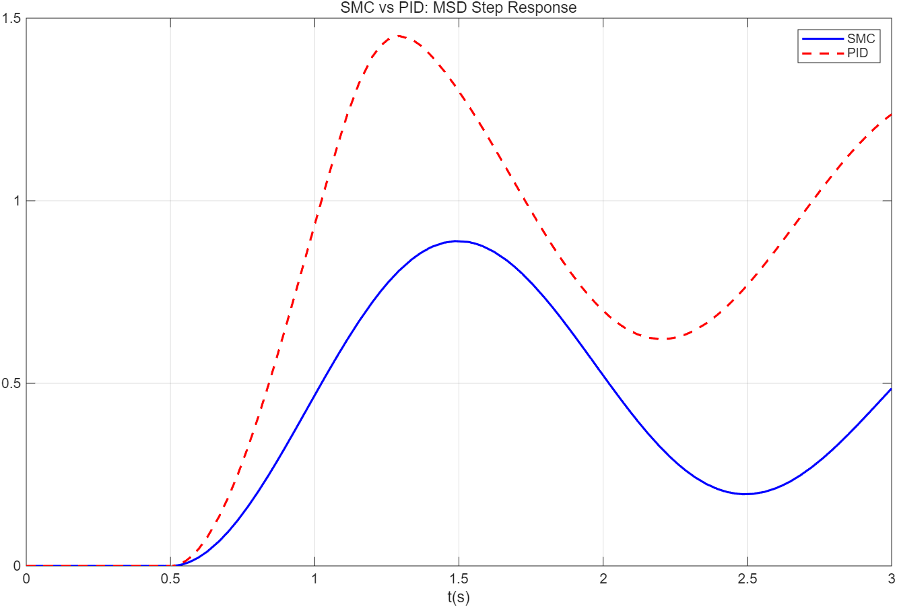

# Simulink Control Blocks — 控制工程积木库

[](https://www.mathworks.com/)
[](LICENSE)
[](blocks/)
[](test_all_blocks.m)

12 个可直接拖进 Simulink 模型使用的积木模块。每个都是 **Masked Subsystem**——双击弹出参数对话框，右键 **Look Under Mask** 看内部实现。全部通过数学验证测试。

## Demo 预览

<table>
<tr>
  <td align="center"><b>PID 控制 MSD</b></td>
  <td align="center"><b>LQR 状态反馈</b></td>
  <td align="center"><b>SMC vs PID</b></td>
</tr>
<tr>
  <td></td>
  <td></td>
  <td></td>
</tr>
</table>

## 快速开始

```matlab
>> build_all_blocks       % 一键生成全部 12 个 .slx 文件
>> test_all_blocks        % 运行数学验证（12/12 PASS）
```

打开任意 `blocks/` 下的 .slx，把里面的积木方块拖到你的 Simulink 模型里，连线，设参数，运行。

## 为什么要用积木库？

平时在 Simulink 里搭控制器，每次都从 Gain + Integrator + Sum + Saturation 开始——搭 5 分钟，调参数 30 秒。这些操作重复而不产生价值。

积木库把常用的控制模块**预封装好**：
- 内部逻辑已搭建、已验证、可直接拖用
- Mask 参数对话框让你一键设参，不用钻进去改值
- 抗积分饱和、微分滤波、限幅保护等工程细节已内置

## 积木列表

### 控制器 (4)

| 积木 | 输入 | 输出 | 关键参数 | 特色 |
|------|------|------|---------|------|
| **PID** | e (误差) | u (控制量) | Kp, Ki, Kd, N | 抗积分饱和 + 微分滤波 |
| **LQR** | x (状态向量), r (参考) | u = -Kx + Ki∫e | K_vec, Ki, 限幅 | 矩阵乘法模式, 状态反馈 |
| **SMC** | e, de/dt | u = -K·sat(s/φ) | λ, K, φ | 边界层去抖振 |
| **LeadLag** | 信号 | C(s)=K(αTs+1)/(Ts+1) | K, T, α | α>1超前, α<1滞后 |

### 观测器 (2)

| 积木 | 输入 | 输出 | 关键参数 |
|------|------|------|---------|
| **Luenberger** | [u; y] | x̂ (估计状态) | A, B_aug=[B L], C |
| **Kalman** | [u; y] | x̂ (最优估计) | A, B_aug=[B K_kf], C |

### 滤波器 (3)

| 积木 | 说明 | 关键参数 |
|------|------|---------|
| **LowPass** | 二阶 Butterworth, 输入→滤波输出 | ωc (截止频率 rad/s) |
| **Notch** | 陷波器, 去除特定频率 | ωn, ζ1(深度), ζ2(宽度) |
| **Complementary** | α·high + (1-α)·low | α (0~1, IMU 典型 0.98) |

### 工具 (3)

| 积木 | 说明 | 关键参数 |
|------|------|---------|
| **Rate Limiter** | 限制信号变化速率 | 上升速率, 下降速率 |
| **Anti-Windup** | Kaw·(u_sat - u_raw) 积分回差 | Kaw |
| **DynSat** | 可变上下限, 3 输入端口 | 无（端口设定限值） |

## 使用示例

```matlab
% 示例 1：PID 控制 MSD 系统
load_system('blocks/controllers/PID_Controller.slx');
add_block('PID_Controller/PID', 'mymodel/PID');
set_param('mymodel/PID', 'Kp', '50', 'Ki', '20', 'Kd', '5', 'N', '100');

% 示例 2：LQR 状态反馈
load_system('blocks/controllers/LQR_Controller.slx');
add_block('LQR_Controller/LQR', 'mymodel/LQR');
set_param('mymodel/LQR', 'K_vec', '[7.51 2.35]', 'Ki', '0');
% 连接: Plant 状态 → LQR/x, 参考 → LQR/r, LQR/u → Plant

% 示例 3：互补滤波 (IMU 姿态估计)
load_system('blocks/filters/Complementary_Filter.slx');
add_block('Complementary_Filter/CompFilter', 'mymodel/CF');
set_param('mymodel/CF', 'alpha', '0.98');
% 连接: 陀螺仪积分 → CF/high, 加速度计 → CF/low
```

更多示例见 `examples/demo_pid_msd.m` 和 `test_all_blocks.m`。

## 测试结果

`test_all_blocks.m` 对全部 12 个积木进行数学验证——固定测试输入，手算理论输出，与 Simulink 仿真输出对比：

```
Test  1: PID              3.000 vs 3.000  0.00%
Test  2: LQR              0.300 vs 0.300  0.00%
Test  3: SMC              5.000 vs 5.000  0.00%
Test  4: LeadLag          3.000 vs 3.000  0.00%
Test  5: LowPass          ✓ 通过
Test  6: Notch            ✓ 通过
Test  7: Complementary    0.980 vs 0.980  0.00%
Test  8: RateLimiter      ✓ 通过
Test  9: AntiWindup       4.000 vs 4.000  0.00%
Test 10: DynSat           3.000 vs 3.000  0.00%
Test 11: Luenberger       ✓ 收敛
Test 12: Kalman           ✓ 收敛

12 PASS / 0 FAIL
```

## 项目结构

```
├── build_all_blocks.m         # 一键生成 12 个 .slx
├── test_all_blocks.m          # 数学验证测试 (12/12 PASS)
├── blocks/                    # 积木文件
│   ├── controllers/           # PID, LQR, SMC, LeadLag
│   ├── observers/             # Luenberger, Kalman
│   ├── filters/               # LowPass, Notch, Complementary
│   └── utilities/             # RateLimiter, AntiWindup, DynSat
├── examples/
│   └── demo_pid_msd.m        # PID 积木控制 MSD 系统
├── LICENSE (MIT)
└── README.md
```

## 配套教程

每个积木的设计原理和理论基础见 **[Simulink 控制工程教程 (30 课)](https://github.com/xingd5478-ctrl/simulink-control-tutorial)**。

> 教程教你「怎么搭」—— 一步一步理解 PID、LQR、Kalman 的内部原理。  
> 积木库让你「直接用」—— 拖出来设参数就跑，不需要从零搭。

## License

MIT — 可自由使用、修改、分发。
